```mermaid
flowchart TD
    START([Submit Request]) --> S0["STEP 0: Bootstrap\nĐọc STATE.md hoặc tạo state files mới\n→ PROJECT.md · REQUIREMENTS.md\n→ ROADMAP.md · STATE.md"]

    S0 --> HUMAN0{{"USER CONFIRMS\nProject context"}}
    HUMAN0 --> S1["STEP 1: Fast Lane Check\nfast-lane-assessment-v1"]

    S1 --> FL{"Fast Lane\nEligible?"}
    FL -- "Yes → skip Steps 2-4" --> S5
    FL -- "No" --> S2

    S2["STEP 2: Brainstorm\nbrainstorming skill\n→ problem · scope · constraints\n→ 2-3 approaches · approved direction\n→ REQUIREMENTS.md updated"]
    S2 --> HUMAN2{{"USER APPROVES\nDesign direction"}}
    HUMAN2 --> S3

    S3["STEP 3: Mode Selection Gate\nmode-selection-criteria.md\n→ Score 5 criteria\n→ Suggest Mode A or B"]
    S3 --> HUMAN3{{"USER APPROVES\nMode A or B"}}
    HUMAN3 --> S4

    S4["STEP 4: Research\nParallel research agents\nMode A: 2 agents · Mode B: 4 agents\n→ .planning/phase-RESEARCH.md"]
    S4 --> HUMAN4{{"USER REVIEWS\nResearch findings"}}
    HUMAN4 --> S5

    S5["STEP 5: Spec Writing\nMode A: brainstorming skill solo\nMode B: phase-discovery-lead\n+ phase-architecture-lead\n→ docs/specs/YYYY-MM-DD-design.md"]
    S5 --> HUMAN5{{"USER APPROVES\nSpec"}}
    HUMAN5 --> S6

    S6["STEP 6: Planning\nMode A: writing-plans skill\nMode B: phase-implementation-lead\nXML tasks + wave grouping\n→ .planning/phase-N-PLAN.md"]
    S6 --> HUMAN6{{"USER APPROVES\nPlan + waves"}}
    HUMAN6 --> S7

    S7["STEP 7: Execute — Wave by Wave\nFresh context per task · Atomic commits\nMode A: subagent-driven-development\nMode B: stack implementer agents\n→ implementer-delivery-v1"]
    S7 --> HUMAN7{{"USER APPROVES\nEach wave result"}}
    HUMAN7 --> WAVE{"More\nwaves?"}
    WAVE -- "Yes" --> S7
    WAVE -- "No" --> S8

    S8["STEP 8: UAT\nAI tạo .planning/phase-UAT.md\nUser tự test feature\n→ uat-gate-v1"]
    S8 --> UATRES{"UAT\nResult?"}
    UATRES -- "Fail → fix plan" --> S7
    UATRES -- "Pass" --> S9

    S9["STEP 9: QA Gate\nMode A: requesting-code-review skill\nMode B: phase-qa-gate + qa-code-reviewer\n→ qa-review-v1"]
    S9 --> HUMAN9{{"USER APPROVES\nQA findings"}}
    HUMAN9 --> QARES{"QA\nDecision?"}
    QARES -- "Block → fix" --> S7
    QARES -- "Approve" --> S10

    S10["STEP 10: Release / DevOps\nMode A: finishing-a-development-branch\nMode B: phase-release-devops-lead\n→ devops-release-v1"]
    S10 --> HUMAN10{{"USER APPROVES\nRelease readiness"}}
    HUMAN10 --> S11

    S11["STEP 11: Ship & Milestone Close\nPR / Merge\n.planning/phase-SUMMARY.md\nROADMAP.md + STATE.md updated\n→ phase-summary-v1"]
    S11 --> ESC{"Risk /\nConflict?"}
    ESC -- "Yes → 2-3 options" --> ESCOUT["Escalation\nUser decides"]
    ESCOUT --> NEXT
    ESC -- "No" --> NEXT

    NEXT{"Next\nMilestone?"}
    NEXT -- "Yes" --> S0
    NEXT -- "No" --> DONE([Done])

    style START fill:#1565C0,color:#fff,stroke:none
    style DONE fill:#1565C0,color:#fff,stroke:none

    style HUMAN0 fill:#E65100,color:#fff,stroke:none
    style HUMAN2 fill:#E65100,color:#fff,stroke:none
    style HUMAN3 fill:#E65100,color:#fff,stroke:none
    style HUMAN4 fill:#E65100,color:#fff,stroke:none
    style HUMAN5 fill:#E65100,color:#fff,stroke:none
    style HUMAN6 fill:#E65100,color:#fff,stroke:none
    style HUMAN7 fill:#E65100,color:#fff,stroke:none
    style HUMAN9 fill:#E65100,color:#fff,stroke:none
    style HUMAN10 fill:#E65100,color:#fff,stroke:none

    style FL fill:#fff,stroke:#1565C0,color:#1565C0
    style WAVE fill:#fff,stroke:#1565C0,color:#1565C0
    style UATRES fill:#fff,stroke:#1565C0,color:#1565C0
    style QARES fill:#fff,stroke:#1565C0,color:#1565C0
    style ESC fill:#fff,stroke:#1565C0,color:#1565C0
    style NEXT fill:#fff,stroke:#1565C0,color:#1565C0

    style S0 fill:#1976D2,color:#fff,stroke:none
    style S1 fill:#1976D2,color:#fff,stroke:none
    style S2 fill:#0D47A1,color:#fff,stroke:none
    style S3 fill:#1976D2,color:#fff,stroke:none
    style S4 fill:#1976D2,color:#fff,stroke:none
    style S5 fill:#0D47A1,color:#fff,stroke:none
    style S6 fill:#0D47A1,color:#fff,stroke:none
    style S7 fill:#1565C0,color:#fff,stroke:none
    style S8 fill:#1976D2,color:#fff,stroke:none
    style S9 fill:#1565C0,color:#fff,stroke:none
    style S10 fill:#1565C0,color:#fff,stroke:none
    style S11 fill:#0D47A1,color:#fff,stroke:none
    style ESCOUT fill:#1976D2,color:#fff,stroke:none
```

# Superpowers + GSD Unified Workflow Diagram

> **Cách xem:** Mở file này trong VS Code → `Ctrl+Shift+V` để preview (cần cài extension [Markdown Preview Mermaid Support](https://marketplace.visualstudio.com/items?itemName=bierner.markdown-mermaid))

---

---

## Thay đổi so với v1 (Brainstorm-First)

| Khía cạnh | v1 | v2 (Unified GSD+Superpowers) |
|---|---|---|
| Session continuity | Memory files (AI-only) | **STATE.md trong repo (ai cũng đọc được)** |
| Research before spec | Không có | **Step 4: parallel research agents** |
| Execution context | Shared context → context rot | **Fresh context per task** |
| Parallel execution | Ad-hoc | **Wave-based: dependency-aware** |
| Git discipline | Không enforce | **Atomic commit sau mỗi task** |
| User verification | Không có UAT gate | **Step 8: UAT gate (human-driven)** |
| Milestone tracking | Không có | **ROADMAP.md + SUMMARY.md per phase** |
| Human touchpoints | Brainstorm + Mode + Spec + Plan | **9 explicit touchpoints (màu cam)** |
