```mermaid
flowchart TD
    START([Submit Request]) --> BOOT["Session Bootstrap\nusing-superpowers skill"]

    BOOT --> FAST{"Fast Lane\nEligible?\nhotfix / small task"}
    FAST -- "Yes" --> FL["fast-lane-assessment-v1\nSkip Brainstorm"]
    FAST -- "No" --> BRAIN

    %% ─── BRAINSTORM FIRST ────────────────────────────────
    BRAIN["Brainstorm\nbrainstorming skill\n→ problem · scope · constraints\n→ 2-3 approaches · trade-offs\n→ approved design direction"]

    FL --> MODE
    BRAIN --> MODE{"Select\nRuntime Mode\nbased on brainstorm output"}

    MODE -- "Mode A\n1 domain · low complexity" --> A_SPEC
    MODE -- "Mode B\nmulti-domain · complex · needs QA/DevOps" --> B_ORCH

    %% ─── MODE A: SPEC + PLAN (SOLO) ──────────────────────
    A_SPEC["Design Spec\nbrainstorming skill\n→ docs/specs/YYYY-MM-DD-design.md\n(self-reviewed + user-approved)"]
    A_SPEC --> A_PLAN["Implementation Plan\nwriting-plans skill\n→ ordered · testable · per-task verification"]
    A_PLAN --> STACKA{"Stack\nDetect"}
    STACKA --> A_IMPL["Implementation\nsubagent-driven-development\nor executing-plans\n+ mandatory stack skill"]
    A_IMPL --> A_TDD["TDD\ntest-driven-development skill\nRED → GREEN → REFACTOR"]
    A_TDD --> A_QA["Code Review\nrequesting-code-review skill\n→ severity findings"]
    A_QA --> QA_A{"Issues\nFound?"}
    QA_A -- "Yes" --> FIX_A["Fix & Re-implement"]
    FIX_A --> A_QA
    QA_A -- "No" --> FINISH["Finish Branch\nfinishing-a-development-branch\n→ Merge / PR / Discard"]
    FINISH --> DONE([Done])

    %% ─── MODE B: SPEC + PLAN (TEAM AGENTS) ───────────────
    B_ORCH["Orchestration Intake\nteam-orchestrator\n→ shared objective · ownership · risks\n→ orchestrator-status-v1"]
    B_ORCH --> B_DISP["Dispatch\nmaster-dispatcher\n→ task_type · selected agent · phase\n→ Dispatcher JSON Contract"]

    B_DISP --> B_DISC["Discovery Phase\nphase-discovery-lead\n→ requirements · acceptance criteria · risk list\n→ phase-lead-report-v1"]
    B_DISC --> B_ARCH["Architecture Phase\nphase-architecture-lead\n→ contracts · interfaces · trade-offs\n→ phase-lead-report-v1 / specialist-report-v1"]

    B_ARCH --> B_SPEC["Design Spec\n(Team Agent)\nphase-discovery-lead + phase-architecture-lead\n→ docs/specs/YYYY-MM-DD-design.md\n→ user-approved"]
    B_SPEC --> B_PLAN["Implementation Plan\n(Team Agent)\nwriting-plans skill\nphase-implementation-lead\n→ approved plan with small tasks"]

    B_PLAN --> STACKB{"Stack\nSelect"}
    STACKB -- "React Native" --> IMP1["implementer-react-native-typescript"]
    STACKB -- ".NET / C#" --> IMP2["implementer-dotnet-csharp"]
    STACKB -- "Angular" --> IMP3["implementer-angular-typescript"]
    STACKB -- "React" --> IMP4["implementer-react-typescript"]
    STACKB -- "IoT/MQTT/BLE" --> IMP5["implementer-iot-edge"]

    IMP1 & IMP2 & IMP3 & IMP4 & IMP5 --> IMPL_OUT["Implementer Delivery\n→ implementer-delivery-v1\n+ mandatory stack skill"]
    IMPL_OUT --> QA_B["QA Gate\nphase-qa-gate · qa-code-reviewer\nrequesting-code-review skill\n→ qa-review-v1"]
    QA_B --> REL_DEC{"Release\nApproved?"}
    REL_DEC -- "Block" --> FIX_B["Fix & Re-implement"]
    FIX_B --> QA_B
    REL_DEC -- "Approve" --> DEVOPS["Release & Ops\nphase-release-devops-lead\n→ devops-release-v1"]
    DEVOPS --> HANDOFF["Final Handoff\nteam-orchestrator\n→ orchestrator-status-v1"]
    HANDOFF --> ESC{"Risk /\nConflict?"}
    ESC -- "No" --> DONE
    ESC -- "Yes" --> ESC_OUT["Escalation\n2–3 options → User decides"]
    ESC_OUT --> DONE

    %% ─── STYLING ──────────────────────────────────────────
    style START fill:#1565C0,color:#fff,stroke:none
    style DONE fill:#1565C0,color:#fff,stroke:none

    style FAST fill:#fff,stroke:#1565C0,color:#1565C0
    style MODE fill:#fff,stroke:#1565C0,color:#1565C0
    style STACKA fill:#fff,stroke:#1565C0,color:#1565C0
    style STACKB fill:#fff,stroke:#1565C0,color:#1565C0
    style QA_A fill:#fff,stroke:#1565C0,color:#1565C0
    style REL_DEC fill:#fff,stroke:#1565C0,color:#1565C0
    style ESC fill:#fff,stroke:#1565C0,color:#1565C0

    style BOOT fill:#1976D2,color:#fff,stroke:none
    style BRAIN fill:#0D47A1,color:#fff,stroke:none
    style FL fill:#1976D2,color:#fff,stroke:none

    style A_SPEC fill:#1976D2,color:#fff,stroke:none
    style A_PLAN fill:#1976D2,color:#fff,stroke:none
    style A_IMPL fill:#1976D2,color:#fff,stroke:none
    style A_TDD fill:#1976D2,color:#fff,stroke:none
    style A_QA fill:#1976D2,color:#fff,stroke:none
    style FIX_A fill:#90CAF9,color:#0D47A1,stroke:none
    style FINISH fill:#1976D2,color:#fff,stroke:none

    style B_ORCH fill:#1565C0,color:#fff,stroke:none
    style B_DISP fill:#1565C0,color:#fff,stroke:none
    style B_DISC fill:#1565C0,color:#fff,stroke:none
    style B_ARCH fill:#1565C0,color:#fff,stroke:none
    style B_SPEC fill:#0D47A1,color:#fff,stroke:none
    style B_PLAN fill:#0D47A1,color:#fff,stroke:none
    style IMP1 fill:#90CAF9,color:#0D47A1,stroke:none
    style IMP2 fill:#90CAF9,color:#0D47A1,stroke:none
    style IMP3 fill:#90CAF9,color:#0D47A1,stroke:none
    style IMP4 fill:#90CAF9,color:#0D47A1,stroke:none
    style IMP5 fill:#90CAF9,color:#0D47A1,stroke:none
    style IMPL_OUT fill:#1565C0,color:#fff,stroke:none
    style QA_B fill:#1565C0,color:#fff,stroke:none
    style FIX_B fill:#90CAF9,color:#0D47A1,stroke:none
    style DEVOPS fill:#1565C0,color:#fff,stroke:none
    style HANDOFF fill:#1565C0,color:#fff,stroke:none
    style ESC_OUT fill:#1976D2,color:#fff,stroke:none
```

# Superpowers Personalized Plugin — Workflow Diagram

> **Cách xem:** Mở file này trong VS Code → `Ctrl+Shift+V` để preview (cần cài extension [Markdown Preview Mermaid Support](https://marketplace.visualstudio.com/items?itemName=bierner.markdown-mermaid))

---

---

## Thay đổi so với version cũ

| Khía cạnh | Version cũ | Version mới |
|---|---|---|
| Thứ tự Brainstorm | Sau khi chọn mode | **Trước khi chọn mode** |
| Cơ sở chọn mode | Tự đánh giá | **Dựa trên output brainstorm** |
| Spec + Plan (Mode B) | Solo | **Chạy qua team agents** (discovery-lead + architecture-lead + implementation-lead) |
| Fast Lane | Bypass brainstorm | Vẫn bypass brainstorm, vào thẳng mode select |
