```mermaid
flowchart TD
    START([Submit Request]) --> S0["STEP 0: Bootstrap\nĐọc STATE.md hoặc tạo state files mới\n→ PROJECT.md · REQUIREMENTS.md · ROADMAP.md · STATE.md"]

    S0 --> HUMAN0{{"USER CONFIRMS\nProject context"}}
    HUMAN0 --> S1["STEP 1: Fast Lane Check\nfast-lane-assessment-v1"]

    S1 --> FL{"Fast Lane\nEligible?"}
    FL -- "Yes → skip Steps 2-4" --> S5
    FL -- "No" --> S2

    S2["STEP 2: Brainstorm\nbrainstorming skill\n→ problem · scope · constraints\n→ 2-3 approaches · approved direction\n→ REQUIREMENTS.md updated"]
    S2 --> HUMAN2{{"USER APPROVES\nDesign direction"}}
    HUMAN2 --> S3

    S3["STEP 3: Mode Selection Gate\nmode-selection-criteria.md\n→ Score 5 criteria\n→ Suggest Mode A or B"]
    S3 --> HUMAN3{{"USER APPROVES\nMode A or B"}}
    HUMAN3 --> S4

    S4["STEP 4: Research\nParallel research agents\nMode A: 2 agents · Mode B: 4 agents\n→ .planning/phase-RESEARCH.md"]
    S4 --> HUMAN4{{"USER REVIEWS\nResearch findings"}}
    HUMAN4 --> S5

    S5["STEP 5: Spec Writing\nMode A: brainstorming skill solo\nMode B: phase-discovery-lead + phase-architecture-lead\n→ docs/specs/YYYY-MM-DD-design.md"]
    S5 --> HUMAN5{{"USER APPROVES\nSpec"}}
    HUMAN5 --> S6

    S6["STEP 6: Planning\nMode A: writing-plans skill\nMode B: phase-implementation-lead\nXML tasks + wave grouping\n→ .planning/phase-N-PLAN.md"]
    S6 --> HUMAN6{{"USER APPROVES\nPlan + waves"}}
    HUMAN6 --> S7

    S7["STEP 7: Execute — Wave by Wave\nFresh context per task · Atomic commits\nMode A: subagent-driven-development\nMode B: stack implementer agents\n→ implementer-delivery-v1"]
    S7 --> HUMAN7{{"USER APPROVES\nEach wave result"}}
    HUMAN7 --> WAVE{"More\nwaves?"}
    WAVE -- "Yes" --> S7
    WAVE -- "No" --> S8

    S8["STEP 8: UAT\nAI tạo .planning/phase-UAT.md\nUser tự test feature\n→ uat-gate-v1"]
    S8 --> UATRES{"UAT\nResult?"}
    UATRES -- "Fail → fix plan" --> S7
    UATRES -- "Pass" --> S9

    S9["STEP 9: QA Gate\nMode A: requesting-code-review skill\nMode B: phase-qa-gate + qa-code-reviewer\n→ qa-review-v1"]
    S9 --> HUMAN9{{"USER APPROVES\nQA findings"}}
    HUMAN9 --> QARES{"QA\nDecision?"}
    QARES -- "Block → fix" --> S7
    QARES -- "Approve" --> S10

    S10["STEP 10: Release / DevOps\nMode A: finishing-a-development-branch\nMode B: phase-release-devops-lead\n→ devops-release-v1"]
    S10 --> HUMAN10{{"USER APPROVES\nRelease readiness"}}
    HUMAN10 --> S11

    S11["STEP 11: Ship & Milestone Close\nPR / Merge\n.planning/phase-SUMMARY.md\nROADMAP.md + STATE.md updated\n→ phase-summary-v1"]
    S11 --> ESC{"Risk /\nConflict?"}
    ESC -- "Yes → 2-3 options" --> ESCOUT["Escalation\nUser decides"]
    ESCOUT --> NEXT
    ESC -- "No" --> NEXT

    NEXT{"Next\nMilestone?"}
    NEXT -- "Yes" --> S0
    NEXT -- "No" --> DONE([Done])

    style START fill:#1565C0,color:#fff,stroke:none
    style DONE fill:#1565C0,color:#fff,stroke:none

    style HUMAN0 fill:#E65100,color:#fff,stroke:none
    style HUMAN2 fill:#E65100,color:#fff,stroke:none
    style HUMAN3 fill:#E65100,color:#fff,stroke:none
    style HUMAN4 fill:#E65100,color:#fff,stroke:none
    style HUMAN5 fill:#E65100,color:#fff,stroke:none
    style HUMAN6 fill:#E65100,color:#fff,stroke:none
    style HUMAN7 fill:#E65100,color:#fff,stroke:none
    style HUMAN9 fill:#E65100,color:#fff,stroke:none
    style HUMAN10 fill:#E65100,color:#fff,stroke:none

    style FL fill:#fff,stroke:#1565C0,color:#1565C0
    style WAVE fill:#fff,stroke:#1565C0,color:#1565C0
    style UATRES fill:#fff,stroke:#1565C0,color:#1565C0
    style QARES fill:#fff,stroke:#1565C0,color:#1565C0
    style ESC fill:#fff,stroke:#1565C0,color:#1565C0
    style NEXT fill:#fff,stroke:#1565C0,color:#1565C0

    style S0 fill:#1976D2,color:#fff,stroke:none
    style S1 fill:#1976D2,color:#fff,stroke:none
    style S2 fill:#0D47A1,color:#fff,stroke:none
    style S3 fill:#1976D2,color:#fff,stroke:none
    style S4 fill:#1976D2,color:#fff,stroke:none
    style S5 fill:#0D47A1,color:#fff,stroke:none
    style S6 fill:#0D47A1,color:#fff,stroke:none
    style S7 fill:#1565C0,color:#fff,stroke:none
    style S8 fill:#1976D2,color:#fff,stroke:none
    style S9 fill:#1565C0,color:#fff,stroke:none
    style S10 fill:#1565C0,color:#fff,stroke:none
    style S11 fill:#0D47A1,color:#fff,stroke:none
    style ESCOUT fill:#1976D2,color:#fff,stroke:none
```

# GSD + Superpowers Unified Workflow — Implementation Plan

> **For agentic workers:** REQUIRED SUB-SKILL: Use superpowers:subagent-driven-development (recommended) or superpowers:executing-plans to implement this plan task-by-task. Steps use checkbox (`- [ ]`) syntax for tracking.

**Goal:** Tích hợp toàn bộ ưu điểm của GSD (state files, research phase, wave-based execution, atomic commits, UAT gate, milestone rhythm) vào workflow Superpowers hiện tại, không trùng lắp chức năng, giữ lại Mode A/B, Fast Lane, QA gate, DevOps phase, và escalation protocol.

**Architecture:** Toàn bộ thay đổi là markdown documentation và agent/skill definition files — không có code. Mỗi task target một file, làm focused edit, verify, và commit. Thứ tự: shared reference files trước, consumer files sau. State files templates được tạo trước để các workflow docs có thể tham chiếu.

**Tech Stack:** Markdown, Git

---

## File Map

| File | Action | Mục đích |
|---|---|---|
| `docs/claude/state-files-guide.md` | CREATE | Hướng dẫn state files (PROJECT.md, STATE.md, REQUIREMENTS.md, ROADMAP.md, SUMMARY.md) |
| `docs/claude/templates/PROJECT.md` | CREATE | Template cho PROJECT.md |
| `docs/claude/templates/STATE.md` | CREATE | Template cho STATE.md |
| `docs/claude/templates/REQUIREMENTS.md` | CREATE | Template cho REQUIREMENTS.md |
| `docs/claude/templates/ROADMAP.md` | CREATE | Template cho ROADMAP.md |
| `docs/claude/templates/phase-SUMMARY.md` | CREATE | Template cho per-phase SUMMARY |
| `docs/claude/templates/phase-UAT.md` | CREATE | Template cho UAT gate |
| `docs/claude/templates/plan-task.xml` | CREATE | Template XML structure cho plan tasks |
| `docs/claude/research-phase-guide.md` | CREATE | Hướng dẫn research phase — agents, outputs, wave structure |
| `docs/claude/agent-output-templates.md` | MODIFY | Thêm UAT template (`uat-gate-v1`) và SUMMARY template (`phase-summary-v1`) |
| `docs/claude/master-dispatcher-prompt.md` | MODIFY | Thêm routing cho research tasks |
| `docs/claude/current-process-workflow.md` | MODIFY | Rewrite thành 11-step unified workflow |
| `docs/claude/workflow-diagram.md` | MODIFY | Cập nhật Mermaid diagram với 11 steps |
| `CLAUDE.md` | MODIFY | Cập nhật execution rules phản ánh unified workflow |

---

## Task 1: Tạo state-files-guide.md

**Files:**
- Create: `docs/claude/state-files-guide.md`

Mục đích: Đây là reference cho toàn bộ workflow. Các files khác sẽ tham chiếu file này. Phải tạo trước.

- [ ] **Step 1: Tạo file**

```markdown
# State Files Guide

State files là "bộ nhớ thực" của project — sống trong repo, đọc được bởi AI và human, persist qua mọi context reset.

## Cấu trúc

```
{project-root}/
├── PROJECT.md          — Vision document, không thay đổi trong milestone
├── REQUIREMENTS.md     — Scope v1/v2 với phase traceability
├── ROADMAP.md          — Milestone list + tiến độ
├── STATE.md            — Đang ở đâu, quyết định gì, blockers
└── .planning/
    ├── {phase}-RESEARCH.md      — Research output per phase
    ├── {phase}-{N}-PLAN.md      — Plan per task group (XML structure)
    ├── {phase}-SUMMARY.md       — Ghi lại những gì đã xảy ra
    └── {phase}-UAT.md           — User acceptance test results
```

## Khi nào tạo

- **New project (Step 0)**: Tạo PROJECT.md + REQUIREMENTS.md + ROADMAP.md + STATE.md
- **Brownfield project (Step 0)**: Map codebase trước → tạo state files từ kết quả mapping
- **Resuming session**: Đọc STATE.md → biết ngay phase, blockers, next action

## Khi nào cập nhật

| File | Cập nhật khi |
|---|---|
| PROJECT.md | Rất hiếm — chỉ khi vision thay đổi근본 |
| REQUIREMENTS.md | Brainstorm output mới, scope thay đổi |
| ROADMAP.md | Milestone complete, milestone mới bắt đầu |
| STATE.md | Sau mỗi step hoàn thành, khi có blocker mới |
| {phase}-RESEARCH.md | Sau Step 4 (Research) |
| {phase}-{N}-PLAN.md | Sau Step 6 (Planning) |
| {phase}-SUMMARY.md | Sau Step 11 (Ship) |
| {phase}-UAT.md | Sau Step 8 (UAT) |

## Templates

Xem `docs/claude/templates/` cho template của từng file.

## Nguyên tắc

- STATE.md là nguồn truth duy nhất cho "đang ở đâu"
- Không ghi code patterns, git history, hay debug solutions vào state files
- Dùng absolute dates không phải relative ("2026-04-08" không phải "hôm nay")
- STATE.md phải đủ để session mới đọc vào và biết chính xác phải làm gì tiếp theo
```

- [ ] **Step 2: Verify file tồn tại và nội dung đúng**

Đọc lại file, confirm có đầy đủ 5 sections: Cấu trúc, Khi nào tạo, Khi nào cập nhật, Templates, Nguyên tắc.

- [ ] **Step 3: Commit**

```bash
git add docs/claude/state-files-guide.md
git commit -m "docs: add state-files-guide for GSD unified workflow"
```

---

## Task 2: Tạo templates cho state files

**Files:**
- Create: `docs/claude/templates/PROJECT.md`
- Create: `docs/claude/templates/STATE.md`
- Create: `docs/claude/templates/REQUIREMENTS.md`
- Create: `docs/claude/templates/ROADMAP.md`

- [ ] **Step 1: Tạo PROJECT.md template**

```markdown
# {Project Name}

## Vision

{Một đoạn mô tả mục tiêu tổng thể của project. Không thay đổi theo milestone.}

## Problem Statement

{Vấn đề gì đang được giải quyết? Ai bị ảnh hưởng? Tại sao quan trọng?}

## Success Criteria

- {Criterion 1 — đo lường được}
- {Criterion 2 — đo lường được}

## Constraints

- {Constraint 1 — technical, time, resource}
- {Constraint 2}

## Stack

- {Technology 1}
- {Technology 2}

## Created

{YYYY-MM-DD}
```

- [ ] **Step 2: Tạo STATE.md template**

```markdown
# Project State

## Current Position

**Phase:** {Step N — tên step}
**Status:** {in_progress | blocked | waiting_for_user}
**Last updated:** {YYYY-MM-DD}

## Current Milestone

**Milestone:** {tên milestone, ví dụ: "M1 — Auth System"}
**Started:** {YYYY-MM-DD}
**Target:** {YYYY-MM-DD hoặc "no deadline"}

## Next Action

{Một câu mô tả chính xác việc phải làm tiếp theo. Đủ để session mới biết bắt đầu từ đâu.}

## Open Blockers

- {Blocker 1: mô tả + owner}

## Key Decisions Made

- {YYYY-MM-DD}: {Quyết định gì} — {Lý do}

## Approved Mode

{Mode A / Mode B} — approved {YYYY-MM-DD}

## Notes

{Bất kỳ context quan trọng nào khác}
```

- [ ] **Step 3: Tạo REQUIREMENTS.md template**

```markdown
# Requirements

**Source:** Brainstorm output {YYYY-MM-DD}
**Phase traceability:** Step 2 (Brainstorm) → Step 5 (Spec)

## Scope

### In Scope (v1)

- {Requirement 1}
- {Requirement 2}

### Out of Scope (v2+)

- {Feature deferred}

## Acceptance Criteria

| # | Criterion | Testable? |
|---|---|---|
| AC-1 | {Criterion} | Yes/No |
| AC-2 | {Criterion} | Yes/No |

## Assumptions

- {Assumption 1}

## Last updated

{YYYY-MM-DD}
```

- [ ] **Step 4: Tạo ROADMAP.md template**

```markdown
# Roadmap

## Active Milestone

**M{N}: {Milestone Name}**
Status: in_progress
Started: {YYYY-MM-DD}
Phases covered: Step 0 → Step 11

## Completed Milestones

| Milestone | Completed | Summary |
|---|---|---|
| M1: {name} | {YYYY-MM-DD} | {one line} |

## Planned Milestones

| Milestone | Goal | Priority |
|---|---|---|
| M{N+1}: {name} | {one line} | high/medium/low |

## Last updated

{YYYY-MM-DD}
```

- [ ] **Step 5: Verify 4 templates tồn tại**

```bash
ls docs/claude/templates/
```

Expected: PROJECT.md, STATE.md, REQUIREMENTS.md, ROADMAP.md

- [ ] **Step 6: Commit**

```bash
git add docs/claude/templates/PROJECT.md docs/claude/templates/STATE.md docs/claude/templates/REQUIREMENTS.md docs/claude/templates/ROADMAP.md
git commit -m "docs: add state file templates (PROJECT, STATE, REQUIREMENTS, ROADMAP)"
```

---

## Task 3: Tạo templates cho phase outputs

**Files:**
- Create: `docs/claude/templates/phase-SUMMARY.md`
- Create: `docs/claude/templates/phase-UAT.md`
- Create: `docs/claude/templates/plan-task.xml`

- [ ] **Step 1: Tạo phase-SUMMARY.md template**

```markdown
# {Phase Name} Summary

**Phase:** {Step N}
**Completed:** {YYYY-MM-DD}
**Mode:** {A / B}

## What Was Built

- {Deliverable 1}
- {Deliverable 2}

## Key Decisions

- {Decision}: {Rationale}

## Commits

- `{hash}`: {message}

## What Worked

- {Observation}

## What Didn't Work / Lessons

- {Lesson}

## Residual Risks

- {Risk}: {Mitigation or status}

## Next Milestone Input

{Những gì phase này tạo ra mà milestone tiếp theo cần biết}
```

- [ ] **Step 2: Tạo phase-UAT.md template**

```markdown
# {Phase Name} — User Acceptance Test

**Phase:** {Step N}
**Date:** {YYYY-MM-DD}
**Tester:** {human}

## Test Against Acceptance Criteria

| # | Criterion | Steps to Test | Result | Notes |
|---|---|---|---|---|
| AC-1 | {criterion} | {how to test} | PASS / FAIL | {note} |
| AC-2 | {criterion} | {how to test} | PASS / FAIL | {note} |

## Overall Result

**PASS / FAIL**

## Issues Found

| # | Description | Severity | Fix Plan |
|---|---|---|---|
| I-1 | {description} | critical/important/minor | {fix-plan file or inline} |

## Decision

- [ ] PASS → proceed to QA Gate (Step 9)
- [ ] FAIL → create fix plan, back to Execute (Step 7)
```

- [ ] **Step 3: Tạo plan-task.xml template**

```xml
<!-- Template cho mỗi task trong .planning/{phase}-{N}-PLAN.md -->
<!-- Wave N: Tasks trong cùng wave chạy song song. Tasks phụ thuộc wave trước chạy sau. -->

<wave number="1" description="Independent tasks — run in parallel">
  <task type="auto">
    <name>{Task name}</name>
    <action>{Mô tả implementation approach — đủ cụ thể để AI hiểu}</action>
    <files>
      <create>{path/to/new/file}</create>
      <modify>{path/to/existing/file}</modify>
    </files>
    <stack>{dotnet | react | react-native | angular | iot-edge}</stack>
    <verify>{Command hoặc check để verify task đã xong}</verify>
    <done>{Success criteria — rõ ràng, đo lường được}</done>
  </task>
</wave>

<wave number="2" description="Dependent on wave 1">
  <task type="auto">
    <name>{Task name}</name>
    <action>{...}</action>
    <files>
      <modify>{...}</modify>
    </files>
    <stack>{...}</stack>
    <verify>{...}</verify>
    <done>{...}</done>
  </task>
</wave>
```

- [ ] **Step 4: Verify 3 templates tồn tại**

```bash
ls docs/claude/templates/
```

Expected: phase-SUMMARY.md, phase-UAT.md, plan-task.xml (cộng với 4 files từ Task 2)

- [ ] **Step 5: Commit**

```bash
git add docs/claude/templates/phase-SUMMARY.md docs/claude/templates/phase-UAT.md docs/claude/templates/plan-task.xml
git commit -m "docs: add phase output templates (SUMMARY, UAT, plan-task XML)"
```

---

## Task 4: Tạo research-phase-guide.md

**Files:**
- Create: `docs/claude/research-phase-guide.md`

Mục đích: Định nghĩa rõ research phase làm gì, agents nào, output là gì. Master dispatcher sẽ tham chiếu file này.

- [ ] **Step 1: Tạo file**

```markdown
# Research Phase Guide (Step 4)

Research phase chạy sau Mode Selection Gate và trước Spec Writing. Mục đích: thu thập evidence trước khi plan, thay vì plan từ assumption.

## Khi nào chạy

- Sau Step 3 (Mode Gate) — cả Mode A và Mode B đều chạy research
- Skip nếu: Fast Lane eligible (task đã rõ ràng, không cần research)

## Mode A: Research (Solo)

Chạy 2 parallel research agents:

| Agent | Nhiệm vụ | Output |
|---|---|---|
| Stack Researcher | Patterns, conventions, best practices cho stack hiện tại | Stack section trong RESEARCH.md |
| Pitfall Researcher | Known issues, anti-patterns, gotchas với approach đang xem xét | Pitfalls section trong RESEARCH.md |

## Mode B: Research (Team)

Chạy 4 parallel research agents:

| Agent | Nhiệm vụ | Output |
|---|---|---|
| Stack Researcher | Patterns, conventions, best practices | Stack section |
| Architecture Researcher | Architecture options, trade-offs, scalability | Architecture section |
| Feature Researcher | Implementation approaches cho từng feature trong scope | Features section |
| Pitfall Researcher | Anti-patterns, known failures, edge cases | Pitfalls section |

## Output Format

Lưu vào `.planning/{phase}-RESEARCH.md`:

```markdown
# {Phase} Research

**Date:** {YYYY-MM-DD}
**Mode:** {A / B}
**Input:** Brainstorm output + approved design direction

## Stack Findings

{Patterns, conventions, libraries phù hợp}

## Architecture Findings (Mode B only)

{Options, trade-offs, recommendation}

## Feature Approach Findings (Mode B only)

{Implementation approach cho từng feature}

## Pitfalls & Anti-patterns

{Known issues, gotchas, cần tránh}

## Recommendation Summary

{Một đoạn tổng hợp — đây là input cho Spec Writing}
```

## Human Touchpoint

Sau khi research xong: User review `.planning/{phase}-RESEARCH.md`, confirm đủ thông tin trước khi tiếp tục Step 5 (Spec).

Nếu thiếu: thêm research agent cho vùng cụ thể, không cần restart toàn bộ phase.

## Dispatcher Routing

Task type: `research-phase-mode-a` hoặc `research-phase-mode-b`
Owner: Orchestrated by main session (Mode A) hoặc team-orchestrator (Mode B)
```

- [ ] **Step 2: Verify file tồn tại và có đủ sections**

Confirm có: Khi nào chạy, Mode A, Mode B, Output Format, Human Touchpoint, Dispatcher Routing.

- [ ] **Step 3: Commit**

```bash
git add docs/claude/research-phase-guide.md
git commit -m "docs: add research-phase-guide for Step 4 of unified workflow"
```

---

## Task 5: Cập nhật agent-output-templates.md

**Files:**
- Modify: `docs/claude/agent-output-templates.md`

Thêm 2 templates mới: `uat-gate-v1` và `phase-summary-v1`.

- [ ] **Step 1: Đọc file hiện tại để biết vị trí append**

Đọc `docs/claude/agent-output-templates.md`, tìm dòng cuối cùng của section cuối (T6: Fast Lane Assessment).

- [ ] **Step 2: Append 2 templates mới vào cuối file**

Thêm sau section T6:

```markdown
## T7: UAT Gate
Template ID: `uat-gate-v1`

```json
{
  "template_id": "uat-gate-v1",
  "phase": "...",
  "date": "YYYY-MM-DD",
  "acceptance_criteria_results": [
    {
      "id": "AC-1",
      "criterion": "...",
      "result": "pass|fail",
      "notes": "..."
    }
  ],
  "issues_found": [
    {
      "id": "I-1",
      "description": "...",
      "severity": "critical|important|minor",
      "fix_plan": "..."
    }
  ],
  "overall_result": "pass|fail",
  "decision": "proceed_to_qa|back_to_execute"
}
```

## T8: Phase Summary
Template ID: `phase-summary-v1`

```json
{
  "template_id": "phase-summary-v1",
  "phase": "...",
  "completed": "YYYY-MM-DD",
  "mode": "A|B",
  "deliverables": ["..."],
  "key_decisions": [
    {
      "decision": "...",
      "rationale": "..."
    }
  ],
  "commits": ["..."],
  "lessons": ["..."],
  "residual_risks": ["..."],
  "next_milestone_input": "..."
}
```
```

- [ ] **Step 3: Verify file có T7 và T8 ở cuối**

Đọc lại file, confirm 2 templates mới xuất hiện sau T6.

- [ ] **Step 4: Commit**

```bash
git add docs/claude/agent-output-templates.md
git commit -m "docs: add uat-gate-v1 and phase-summary-v1 output templates"
```

---

## Task 6: Cập nhật master-dispatcher-prompt.md

**Files:**
- Modify: `docs/claude/master-dispatcher-prompt.md`

Thêm routing cho research tasks vào Routing Table và Stack Detector.

- [ ] **Step 1: Đọc Routing Table hiện tại**

Đọc `docs/claude/master-dispatcher-prompt.md`, tìm section `## Routing Table`.

- [ ] **Step 2: Thêm research routing vào Routing Table**

Thêm 2 dòng mới vào Routing Table sau `spec-discovery`:

```markdown
- `research-phase-mode-a` -> main session (2 parallel research subagents: stack + pitfall)
- `research-phase-mode-b` -> `team-orchestrator` (4 parallel research subagents: stack + architecture + feature + pitfall)
```

- [ ] **Step 3: Thêm UAT routing**

Thêm sau research routing:

```markdown
- `uat-gate` -> human (AI tạo `.planning/{phase}-UAT.md` template, user điền kết quả)
- `phase-summary` -> main session or `team-orchestrator` (tổng hợp sau Ship)
```

- [ ] **Step 4: Cập nhật Required Handoff Block**

Trong section `## Required Handoff Block`, thêm `wave_number` và `fresh_context` vào danh sách fields khi task type là execution:

```markdown
## Execution Task Additional Fields
When task_type is implementation or research:
- `wave_number`: wave number trong execution sequence
- `fresh_context`: true (mỗi task chạy trong context độc lập)
- `atomic_commit`: true (commit sau khi task hoàn thành)
```

- [ ] **Step 5: Verify thay đổi chính xác**

Đọc lại file, confirm routing table có 4 dòng mới, handoff block có execution fields.

- [ ] **Step 6: Commit**

```bash
git add docs/claude/master-dispatcher-prompt.md
git commit -m "docs: add research, UAT, and summary routing to master-dispatcher"
```

---

## Task 7: Rewrite current-process-workflow.md

**Files:**
- Modify: `docs/claude/current-process-workflow.md`

Đây là task trung tâm — rewrite toàn bộ thành 11-step unified workflow.

- [ ] **Step 1: Đọc file hiện tại để backup mental model**

Đọc `docs/claude/current-process-workflow.md` lần cuối trước khi overwrite.

- [ ] **Step 2: Overwrite với unified workflow**

```markdown
# Unified Workflow: GSD + Superpowers (v2)

Workflow kết hợp GSD state management, research phase, wave-based execution, UAT gate, và milestone rhythm với Superpowers Mode A/B, Fast Lane, QA gate, DevOps phase, và escalation protocol.

**Nguyên tắc:** AI đồng hành qua từng step — không tự động chạy step tiếp theo mà không có human approval.

Reference files:
- State files: `docs/claude/state-files-guide.md`
- Templates: `docs/claude/templates/`
- Research phase: `docs/claude/research-phase-guide.md`
- Mode selection: `docs/claude/mode-selection-criteria.md`
- Agent templates: `docs/claude/agent-output-templates.md`
- Stack skill map: `docs/claude/stack-skill-rule-map.md`

---

## STEP 0 — Project Bootstrap

**Làm gì:** Thiết lập hoặc đọc project state để biết context đầy đủ trước khi làm bất kỳ điều gì.

**New project:**
- Tạo PROJECT.md, REQUIREMENTS.md, ROADMAP.md, STATE.md từ templates trong `docs/claude/templates/`
- Tạo thư mục `.planning/`

**Brownfield project:**
- Map codebase: phân tích stack, conventions, architecture patterns hiện tại
- Tạo state files từ kết quả mapping

**Resuming session:**
- Đọc STATE.md → biết ngay: đang ở Step nào, next action là gì, blockers là gì
- Tiếp tục từ step đó, không restart

**Human touchpoint:** User xác nhận project context trước khi tiếp tục.

**Output:** PROJECT.md, REQUIREMENTS.md, ROADMAP.md, STATE.md (created hoặc read)

---

## STEP 1 — Fast Lane Check

**Làm gì:** Đánh giá task có đủ điều kiện Fast Lane không.

**Fast Lane criteria (tất cả phải đúng):**
- Fix scope rõ ràng, không ambiguous
- Thay đổi nhỏ (1-2 files)
- Không có architecture/API contract change
- Không có security hoặc data migration impact
- Regression risk thấp

**Nếu eligible:** Skip Steps 2-4, vào thẳng Step 5 (Spec) với Fast Lane output làm input
**Nếu not eligible:** Tiếp tục Step 2

**Template output:** `fast-lane-assessment-v1`

**Human touchpoint:** User confirm Fast Lane hoặc full workflow.

---

## STEP 2 — Brainstorm

**Làm gì:** Hiểu rõ yêu cầu, scope, constraints. Propose 2-3 approaches với trade-offs.

**Skill:** `skills/brainstorming/SKILL.md`

**Output:**
- Problem statement, scope, constraints, success criteria
- 2-3 approaches với trade-offs
- Approved design direction
- REQUIREMENTS.md được cập nhật từ brainstorm output

**Human touchpoint:** User approve design direction. Không tiếp tục nếu chưa approve.

---

## STEP 3 — Mode Selection Gate

**Làm gì:** Score 5 criteria từ brainstorm output, suggest Mode A hoặc B.

**Reference:** `docs/claude/mode-selection-criteria.md`

**Scoring criteria:**
1. Domain count (1 vs 2+)
2. Risk level (low/medium/high)
3. QA/DevOps gate needed (yes/no)
4. Cross-team coordination (yes/no)
5. Output format (formal/informal)

**Threshold:** 0-1 B signals → Mode A | 2 B signals → Mode A (Mode B viable) | 3+ → Mode B

**Mode A:** Solo, nhẹ, 1 domain, không cần formal QA gate
**Mode B:** AI team spine, multi-domain, cần QA/DevOps formal, role-based ownership

**Human touchpoint:** User approve mode. Sau đây mode không thay đổi nữa — đây là source of truth.

---

## STEP 4 — Research

**Làm gì:** Parallel research agents thu thập evidence trước khi viết spec/plan.

**Reference:** `docs/claude/research-phase-guide.md`

**Mode A:** 2 parallel agents (Stack Researcher + Pitfall Researcher)
**Mode B:** 4 parallel agents (Stack + Architecture + Feature + Pitfall)

**Output:** `.planning/{phase}-RESEARCH.md`

**Human touchpoint:** User review research findings, confirm đủ trước khi tiếp tục Step 5.
Nếu thiếu: thêm targeted research agent, không cần restart phase.

**Skip nếu:** Fast Lane eligible.

---

## STEP 5 — Spec Writing

**Làm gì:** Viết technical spec từ brainstorm output + research findings.

**Mode A:** `skills/brainstorming/SKILL.md` — solo spec writing
**Mode B:** `agents/phase-discovery-lead.md` + `agents/phase-architecture-lead.md`
- phase-discovery-lead: formalize requirements spec từ brainstorm output
- phase-architecture-lead: formalize technical spec (contracts, interfaces, trade-offs)
- Input: brainstorm output + research findings (không re-brainstorm)

**Output:** `docs/superpowers/specs/YYYY-MM-DD-{topic}-design.md`

**Mode B output templates:** `phase-lead-report-v1`

**Human touchpoint:** User approve spec. Nếu cần sửa → quay lại spec, không brainstorm lại.

---

## STEP 6 — Planning

**Làm gì:** Viết implementation plan dạng XML tasks, nhóm theo waves.

**Mode A:** `skills/writing-plans/SKILL.md`
**Mode B:** `agents/phase-implementation-lead.md`

**Task structure:** XML format — xem `docs/claude/templates/plan-task.xml`

**Wave grouping:**
- Tasks độc lập (không phụ thuộc nhau) → cùng wave, chạy song song
- Tasks phụ thuộc vào wave trước → wave sau

**Output:** `.planning/{phase}-{N}-PLAN.md`

**Human touchpoint:** User approve plan + wave structure trước khi execute. Nếu cần sửa → edit plan, không rewrite spec.

---

## STEP 7 — Execution (Wave by Wave)

**Làm gì:** Execute từng wave, mỗi task trong fresh context độc lập.

**Skill:** `skills/subagent-driven-development/SKILL.md` hoặc `skills/executing-plans/SKILL.md`

**Cơ chế:**
- Cùng wave → tasks chạy song song (subagent per task)
- Fresh context per task: mỗi subagent chỉ nhận đúng files cần thiết cho task đó
- Stack skill mandatory: dotnet/react/react-native/angular/iot-edge theo `docs/claude/stack-skill-rule-map.md`
- Atomic commit: task xong → commit ngay (`feat({phase}): {task name}`)

**Mode B:** Stack implementer agents được dispatcher chọn
- `agents/implementer-react-native-typescript.md`
- `agents/implementer-dotnet-csharp.md`
- `agents/implementer-angular-typescript.md`
- `agents/implementer-react-typescript.md`
- `agents/implementer-iot-edge.md`
- Output: `implementer-delivery-v1`

**Human touchpoint:** User approve kết quả mỗi wave trước khi chạy wave tiếp theo.

---

## STEP 8 — UAT (User Acceptance Testing)

**Làm gì:** User tự test feature theo acceptance criteria. AI không tự claim "done".

**Cơ chế:**
- AI tạo `.planning/{phase}-UAT.md` từ template
- User chạy feature, test từng AC, ghi kết quả
- AI không tự verify thay user — đây là human step

**Pass:** Tiếp tục Step 9 (QA Gate)
**Fail:** AI tạo fix plan → back to Step 7 (không replan toàn bộ, chỉ fix tasks cụ thể)

**Template output:** `uat-gate-v1`

**Human touchpoint:** Đây toàn bộ là human step. AI hỗ trợ tạo fix plan nếu cần.

---

## STEP 9 — QA Gate

**Làm gì:** Formal QA review với severity classification.

**Mode A:** `skills/requesting-code-review/SKILL.md`
**Mode B:** `agents/phase-qa-gate.md` + `agents/qa-code-reviewer.md`

**Findings severity:** Critical | Important | Suggestion

**Block:** Fix → back to Step 7 với targeted fix plan
**Approve / Approve with conditions:** Tiếp tục Step 10

**Template output:** `qa-review-v1`

**Human touchpoint:** User review QA findings, quyết định fix hay approve-with-conditions.

---

## STEP 10 — Release / DevOps

**Làm gì:** CI/CD plan, deployment strategy, rollback, observability.

**Mode A:** `skills/finishing-a-development-branch/SKILL.md`
**Mode B:** `agents/phase-release-devops-lead.md` + `agents/devops-cicd-assistant.md`

**Template output (Mode B):** `devops-release-v1`

**Human touchpoint:** User approve release readiness trước khi ship.

**Skip nếu:** Mode A và task không cần formal release gate.

---

## STEP 11 — Ship & Milestone Close

**Làm gì:** Merge/PR + cập nhật state files + mở milestone mới nếu cần.

**Cơ chế:**
1. Tạo PR hoặc merge theo strategy từ Step 10
2. Viết `.planning/{phase}-SUMMARY.md` — ghi: đã làm gì, quyết định gì, học được gì
3. Cập nhật ROADMAP.md: milestone này done
4. Cập nhật STATE.md: current position = start of next milestone (hoặc project complete)
5. Escalation: nếu có risk/conflict chưa resolve → 2-3 options cho user quyết định

**Template output:** `phase-summary-v1`
**Mode B:** `agents/team-orchestrator.md` tổng hợp final handoff (`orchestrator-status-v1`)

**Human touchpoint:** User quyết định ship, review summary, quyết định next milestone.

---

## Fast Lane Path

```
STEP 0 (Bootstrap) → STEP 1 (Fast Lane: eligible) → STEP 5 (Spec) → STEP 6 (Plan)
→ STEP 7 (Execute) → STEP 8 (UAT) → STEP 9 (QA) → STEP 11 (Ship)
```

Skip: Steps 2, 3, 4, 10 (trừ khi Mode B và cần formal release gate)

---

## Full Path Summary

```
STEP 0:  Bootstrap        → đọc/tạo state files                [USER CONFIRMS]
STEP 1:  Fast Lane?       → eligible: skip to STEP 5           [USER CONFIRMS]
STEP 2:  Brainstorm       → approved design direction           [USER APPROVES]
STEP 3:  Mode Gate        → Mode A hoặc B                      [USER APPROVES]
STEP 4:  Research         → parallel agents, RESEARCH.md        [USER REVIEWS]
STEP 5:  Spec             → solo (A) / team agents (B)          [USER APPROVES]
STEP 6:  Plan             → XML tasks + wave grouping           [USER APPROVES]
STEP 7:  Execute          → wave by wave, fresh context         [USER APPROVES each wave]
STEP 8:  UAT              → user tests feature                  [USER DRIVES]
STEP 9:  QA Gate          → severity findings + fix loop        [USER APPROVES]
STEP 10: Release/DevOps   → CI/CD plan (Mode B)                [USER APPROVES]
STEP 11: Ship             → PR/merge + summary + next milestone [USER DECIDES]
```

---

## Output Standards

- Mode A: Superpowers skill outputs
- Mode B: template_id từ `docs/claude/agent-output-templates.md` (bắt buộc)
- Cả hai: atomic commits sau mỗi task trong Step 7
- Cả hai: state files luôn cập nhật sau mỗi step hoàn thành
```

- [ ] **Step 3: Verify file có đủ 11 steps và đều có Human touchpoint**

Đọc lại file, confirm STEP 0 đến STEP 11 đều có mặt, mỗi step có: Làm gì, cơ chế/skill, output, human touchpoint.

- [ ] **Step 4: Commit**

```bash
git add docs/claude/current-process-workflow.md
git commit -m "docs: rewrite workflow as 11-step GSD+Superpowers unified workflow"
```

---

## Task 8: Cập nhật workflow-diagram.md

**Files:**
- Modify: `docs/claude/workflow-diagram.md`

Cập nhật Mermaid diagram để phản ánh 11 steps mới.

- [ ] **Step 1: Overwrite Mermaid diagram với 11 steps**

```markdown
# Superpowers + GSD Unified Workflow Diagram

> **Cách xem:** Mở file này trong VS Code → `Ctrl+Shift+V` (cần extension Markdown Preview Mermaid Support)

---



---

## Thay đổi so với v1 (Brainstorm-First)

| Khía cạnh | v1 | v2 (Unified GSD+Superpowers) |
|---|---|---|
| Session continuity | Memory files (AI-only) | **STATE.md trong repo (ai cũng đọc được)** |
| Research before spec | Không có | **Step 4: parallel research agents** |
| Execution context | Shared context → context rot | **Fresh context per task** |
| Parallel execution | Ad-hoc | **Wave-based: dependency-aware** |
| Git discipline | Không enforce | **Atomic commit sau mỗi task** |
| User verification | Không có | **Step 8: UAT gate** |
| Milestone tracking | Không có | **ROADMAP.md + SUMMARY.md** |
| Human touchpoints | Brainstorm + Mode + Spec + Plan | **9 explicit touchpoints** |
```

- [ ] **Step 2: Verify diagram có đủ S0-S11 và human touchpoints màu cam**

Đọc lại, confirm mỗi STEP node có mặt, HUMAN nodes có màu `#E65100`.

- [ ] **Step 3: Commit**

```bash
git add docs/claude/workflow-diagram.md
git commit -m "docs: update workflow diagram to 11-step GSD+Superpowers unified flow"
```

---

## Task 9: Cập nhật CLAUDE.md

**Files:**
- Modify: `CLAUDE.md`

Cập nhật execution rules trong section "Personalized Plugin Mode" để phản ánh unified workflow.

- [ ] **Step 1: Đọc CLAUDE.md section hiện tại**

Đọc `CLAUDE.md`, tìm section "Personalized Plugin Mode (This Workspace)".

- [ ] **Step 2: Replace execution rules**

Thay thế đoạn từ "Execution rule in this workspace:" đến hết phần bullet points bằng:

```markdown
Execution rule in this workspace:
- **STEP 0:** Đọc STATE.md (nếu đang resume) hoặc tạo state files mới từ templates trong `docs/claude/templates/`.
- **STEP 1:** Chạy Fast Lane check trước mọi task. Nếu eligible, skip Steps 2-4.
- **STEP 2:** Brainstorm phase (`skills/brainstorming/SKILL.md`) — bắt buộc trừ Fast Lane. Output: approved design direction + REQUIREMENTS.md updated.
- **STEP 3:** Mode Selection Gate — đọc `docs/claude/mode-selection-criteria.md`, score 5 criteria, suggest mode, chờ user approve. Sau approve, mode không thay đổi.
- **STEP 4:** Research phase — xem `docs/claude/research-phase-guide.md`. Mode A: 2 agents. Mode B: 4 agents. Output: `.planning/{phase}-RESEARCH.md`. Skip nếu Fast Lane.
- **STEP 5:** Spec Writing — Mode A: `skills/brainstorming/SKILL.md` solo. Mode B: phase-discovery-lead + phase-architecture-lead dùng brainstorm output + research (không re-brainstorm).
- **STEP 6:** Planning — Mode A: `skills/writing-plans/SKILL.md`. Mode B: phase-implementation-lead. XML task format + wave grouping. Output: `.planning/{phase}-{N}-PLAN.md`.
- **STEP 7:** Execution wave by wave — fresh context per task, atomic commit sau mỗi task, stack skill mandatory (`docs/claude/stack-skill-rule-map.md`). User approve mỗi wave trước khi tiếp.
- **STEP 8:** UAT — AI tạo `.planning/{phase}-UAT.md`, user tự test. AI không tự claim done. Fail → fix plan → back to Step 7.
- **STEP 9:** QA Gate — Mode A: `skills/requesting-code-review/SKILL.md`. Mode B: phase-qa-gate + qa-code-reviewer. Block → fix. Approve → tiếp.
- **STEP 10:** Release/DevOps — Mode A: `skills/finishing-a-development-branch/SKILL.md`. Mode B: phase-release-devops-lead.
- **STEP 11:** Ship — PR/merge + `.planning/{phase}-SUMMARY.md` + cập nhật ROADMAP.md và STATE.md.
- **Không tự động advance:** Dừng sau mỗi step, chờ user confirm trước khi tiếp tục.
- **Full reference:** `docs/claude/current-process-workflow.md`
```

- [ ] **Step 3: Verify thay đổi chính xác**

Đọc lại section, confirm có STEP 0 đến STEP 11, có note "Không tự động advance".

- [ ] **Step 4: Commit**

```bash
git add CLAUDE.md
git commit -m "docs: update CLAUDE.md execution rules to 11-step unified workflow"
```

---

## Self-Review

- [ ] **Spec coverage check:** Tất cả 11 steps trong design đều có task implement:
  - Step 0 (Bootstrap): Task 1+2 (state-files-guide + templates)
  - Step 4 (Research): Task 4 (research-phase-guide)
  - Step 8 (UAT): Task 3 (phase-UAT.md template) + Task 5 (uat-gate-v1 template)
  - Step 11 (SUMMARY): Task 3 (phase-SUMMARY.md template) + Task 5 (phase-summary-v1 template)
  - Wave execution / atomic commits / fresh context: Task 7 (workflow) + Task 9 (CLAUDE.md)
  - Routing updates: Task 6 (master-dispatcher)
  - Diagram: Task 8

- [ ] **Placeholder scan:** Không có TBD, TODO, "similar to Task N" trong plan này.

- [ ] **Dependency check:** Tasks 1-4 tạo reference files → Task 5-6 modify files yang cite chúng → Task 7 là central workflow → Task 8 diagram → Task 9 CLAUDE.md là entry point. Thứ tự đúng.
