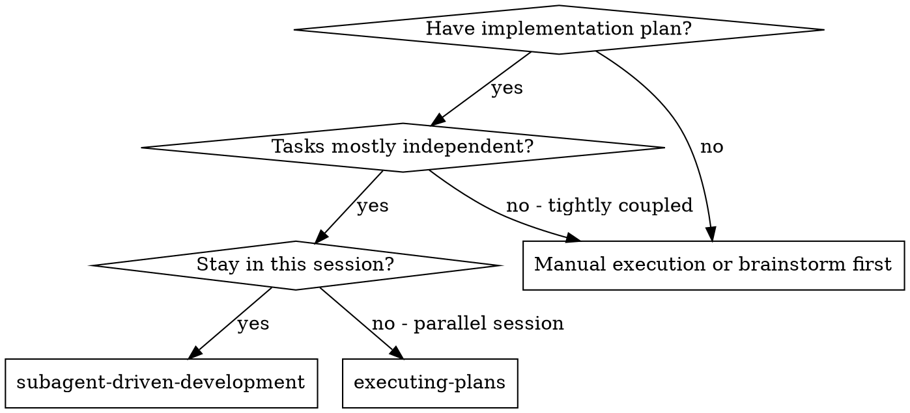
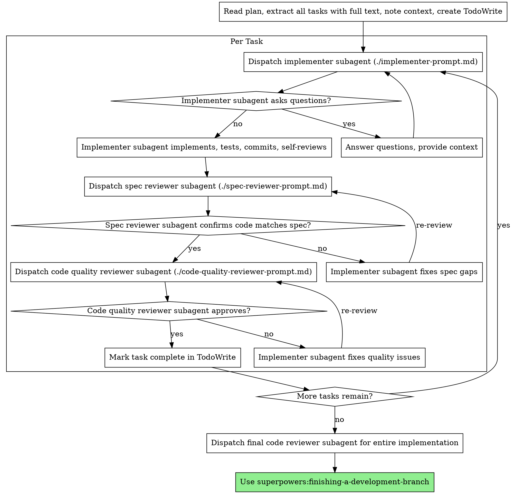

# Subagent-Driven Development

Execute plan by dispatching fresh subagent per task, with two-stage review after each: spec compliance review first, then code quality review.

**Why subagents:** You delegate tasks to specialized agents with isolated context. By precisely crafting their instructions and context, you ensure they stay focused and succeed at their task. They should never inherit your session's context or history — you construct exactly what they need. This also preserves your own context for coordination work.

**Core principle:** Fresh subagent per task + two-stage review (spec then quality) = high quality, fast iteration

**Continuous execution:** Do not pause to check in with your human partner between tasks. Execute all tasks from the plan without stopping. The only reasons to stop are: BLOCKED status you cannot resolve, ambiguity that genuinely prevents progress, or all tasks complete. "Should I continue?" prompts and progress summaries waste their time — they asked you to execute the plan, so execute it. **Exception:** the Pre-Task Confirmation step below remains required when `mode: yolo` is not set in `.planning/config.json`.

## When to Use



**vs. Executing Plans (parallel session):**
- Same session (no context switch)
- Fresh subagent per task (no context pollution)
- Two-stage review after each task: spec compliance first, then code quality
- Faster iteration (no human-in-loop between tasks)

## The Process



## Model Selection

Each task in the plan has a `<model>` element specifying the exact model to use (`haiku`, `sonnet`, or `opus`). The planner assigns this based on task complexity; the user may override per task before approving the plan.

**Controller dispatch rule:** Read `<model>` from the task XML and dispatch the subagent with that model. Do not re-evaluate — the plan is the source of truth for model assignment.

**Escalation on BLOCKED:** If a subagent reports BLOCKED and the blocker suggests insufficient reasoning capability, escalate to the next tier:
- `haiku` → re-dispatch with `sonnet`
- `sonnet` → re-dispatch with `opus`
- `opus` → escalate to human (cannot go higher)

**Fallback (no `<model>` in task):** If a task has no `<model>` element (legacy plans), apply complexity signals:
- 1-2 files with complete spec → `haiku` (or `model_defaults.mechanical` from config.json)
- Multiple files with integration concerns → `sonnet` (or `model_defaults.standard`)
- Design judgment or broad codebase understanding → `opus` (or `model_defaults.complex`)

## Pre-Task Confirmation

Before dispatching each task, confirm with the user:

```
Task: {task name}
Model: {haiku/sonnet/opus} (from plan)
Files: {files_modified}

Proceed with this model, or switch? [proceed / haiku / sonnet / opus]
```

- `proceed` → dispatch with the model from the plan
- User picks a different model → override for this task only (does not change the plan)
- Skip confirmation when `mode: yolo` in config.json — use model from plan directly

## Handling Implementer Status

Implementer subagents report one of four statuses. Handle each appropriately:

**DONE:** Proceed to spec compliance review.

**DONE_WITH_CONCERNS:** The implementer completed the work but flagged doubts. Read the concerns before proceeding. If the concerns are about correctness or scope, address them before review. If they're observations (e.g., "this file is getting large"), note them and proceed to review.

**NEEDS_CONTEXT:** The implementer needs information that wasn't provided. Provide the missing context and re-dispatch.

**BLOCKED:** The implementer cannot complete the task. Assess the blocker:
1. If it's a context problem, provide more context and re-dispatch with the same model
2. If the task requires more reasoning, re-dispatch with a more capable model
3. If the task is too large, break it into smaller pieces
4. If the plan itself is wrong, escalate to the human

**Never** ignore an escalation or force the same model to retry without changes. If the implementer said it's stuck, something needs to change.

## Prompt Templates

- `./implementer-prompt.md` - Dispatch implementer subagent
- `./spec-reviewer-prompt.md` - Dispatch spec compliance reviewer subagent
- `./code-quality-reviewer-prompt.md` - Dispatch code quality reviewer subagent

## Example Workflow

```
You: I'm using Subagent-Driven Development to execute this plan.

[Read plan file once: docs/superpowers/plans/feature-plan.md]
[Extract all 5 tasks with full text and context]
[Create TodoWrite with all tasks]

Task 1: Hook installation script

[Get Task 1 text and context (already extracted)]
[Dispatch implementation subagent with full task text + context]

Implementer: "Before I begin - should the hook be installed at user or system level?"

You: "User level (~/.config/superpowers/hooks/)"

Implementer: "Got it. Implementing now..."
[Later] Implementer:
  - Implemented install-hook command
  - Added tests, 5/5 passing
  - Self-review: Found I missed --force flag, added it
  - Committed

[Dispatch spec compliance reviewer]
Spec reviewer: ✅ Spec compliant - all requirements met, nothing extra

[Get git SHAs, dispatch code quality reviewer]
Code reviewer: Strengths: Good test coverage, clean. Issues: None. Approved.

[Mark Task 1 complete]

Task 2: Recovery modes

[Get Task 2 text and context (already extracted)]
[Dispatch implementation subagent with full task text + context]

Implementer: [No questions, proceeds]
Implementer:
  - Added verify/repair modes
  - 8/8 tests passing
  - Self-review: All good
  - Committed

[Dispatch spec compliance reviewer]
Spec reviewer: ❌ Issues:
  - Missing: Progress reporting (spec says "report every 100 items")
  - Extra: Added --json flag (not requested)

[Implementer fixes issues]
Implementer: Removed --json flag, added progress reporting

[Spec reviewer reviews again]
Spec reviewer: ✅ Spec compliant now

[Dispatch code quality reviewer]
Code reviewer: Strengths: Solid. Issues (Important): Magic number (100)

[Implementer fixes]
Implementer: Extracted PROGRESS_INTERVAL constant

[Code reviewer reviews again]
Code reviewer: ✅ Approved

[Mark Task 2 complete]

...

[After all tasks]
[Dispatch final code-reviewer]
Final reviewer: All requirements met, ready to merge

Done!
```

## Advantages

**vs. Manual execution:**
- Subagents follow TDD naturally
- Fresh context per task (no confusion)
- Parallel-safe (subagents don't interfere)
- Subagent can ask questions (before AND during work)

**vs. Executing Plans:**
- Same session (no handoff)
- Continuous progress (no waiting)
- Review checkpoints automatic

**Efficiency gains:**
- No file reading overhead (controller provides full text)
- Controller curates exactly what context is needed
- Subagent gets complete information upfront
- Questions surfaced before work begins (not after)

**Quality gates:**
- Self-review catches issues before handoff
- Two-stage review: spec compliance, then code quality
- Review loops ensure fixes actually work
- Spec compliance prevents over/under-building
- Code quality ensures implementation is well-built

**Cost:**
- More subagent invocations (implementer + 2 reviewers per task)
- Controller does more prep work (extracting all tasks upfront)
- Review loops add iterations
- But catches issues early (cheaper than debugging later)

## Red Flags

**Never:**
- Start implementation on main/master branch without explicit user consent
- Skip reviews (spec compliance OR code quality)
- Proceed with unfixed issues
- Dispatch multiple implementation subagents in parallel (conflicts)
- Make subagent read plan file (provide full text instead)
- Skip scene-setting context (subagent needs to understand where task fits)
- Ignore subagent questions (answer before letting them proceed)
- Accept "close enough" on spec compliance (spec reviewer found issues = not done)
- Skip review loops (reviewer found issues = implementer fixes = review again)
- Let implementer self-review replace actual review (both are needed)
- **Start code quality review before spec compliance is ✅** (wrong order)
- Move to next task while either review has open issues

**If subagent asks questions:**
- Answer clearly and completely
- Provide additional context if needed
- Don't rush them into implementation

**If reviewer finds issues:**
- Implementer (same subagent) fixes them
- Reviewer reviews again
- Repeat until approved
- Don't skip the re-review

**If subagent fails task:**
- Dispatch fix subagent with specific instructions
- Don't try to fix manually (context pollution)

## Update STATE.md (mandatory after each task)

After each task completes (passes both spec + code-quality review), update `STATE.md`:

- **Current Position → Phase:** `Step 7 — Execute (task <id> complete, <N>/<total> done)`
- **Status:** `in_progress` while tasks remain; `complete` when all done
- **Last updated:** today's date in `YYYY-MM-DD`
- **Next Action:** `Dispatch task <id+1>` or `Run STEP 8 UAT` if last task
- **Open Blockers:** if BLOCKED on a task and stuck after escalation, record it here

This update happens between tasks, NOT after every subagent dispatch. It's part of the controller loop, not the implementer subagent's job.

**Continuous execution exception:** even though "Continuous execution" rule above says no progress summaries to user between tasks, the STATE.md write is still required — it's a file write, not a user prompt. It does not pause execution.

If `commit_atomic: true` in config.json, commit STATE.md with each task. If `commit_atomic: false`, commit at end of wave.

## Telemetry capture (gated by `workflow.telemetry`)

At the **same per-task controller point** as the STATE.md update above (after both reviews pass), the controller also records telemetry — **only when `workflow.telemetry: true` in `.planning/config.json`**. When the flag is `false` (the default), this step is a **no-op**: skip it entirely, write nothing.

**This is controller-loop behavior, NOT a hook.** Token counts, the per-subagent model, and escalation events are controller-side workflow state — a `PostToolUse`/`Stop` hook cannot see them reliably, and on Windows without Git Bash a hook silently no-ops (empty telemetry looks like a clean run). The controller already writes per-task STATE.md; the telemetry write rides that same point.

When gated on, **append exactly one line per task** to `.planning/{phase}-telemetry.jsonl` (`{phase}` = the current phase slug, e.g. `process-2.0`). The file is **append-only JSONL** — one JSON object per line, never rewritten. Append-only is deliberate: it is crash-tolerant, so a partial/truncated final line never corrupts the prior task records.

Each line is a JSON object with these fields:

| Field | Meaning |
|---|---|
| `task_id` | the task id/name from the plan XML |
| `req_ids` | array of REQ-IDs the task satisfied |
| `model` | the model that produced the accepted result (final model if escalated) |
| `wall_clock` | elapsed time for the task (e.g. seconds, or `"m:ss"`) |
| `escalation` | escalation path if any, e.g. `"haiku->sonnet"`; omit or `null` when none |
| `result` | task outcome — one of `done` / `done_with_concerns` / `blocked` / `skipped` (matches the `phase-summary-v1` contract) |
| `tokens` | **optional** — include **only when the harness exposes a real token count**. Never fabricate a token count; omit the key entirely when unavailable. |

Example (one line):

```jsonl
{"task_id":"OBS-01","req_ids":["OBS-01"],"model":"opus","wall_clock":"1:42","escalation":null,"result":"done"}
```

Like the STATE.md write, this is a file append, not a user prompt — it does not pause continuous execution. Follow the same commit rule: with `commit_atomic: true` the JSONL is committed per task; with `commit_atomic: false`, at end of wave. STEP 11 (`finishing-a-development-branch`) reads this file to render the SUMMARY telemetry table.

## Integration

**Required workflow skills:**
- **superpowers:using-git-worktrees** - REQUIRED: Set up isolated workspace before starting
- **superpowers:writing-plans** - Creates the plan this skill executes
- **superpowers:requesting-code-review** - Code review template for reviewer subagents
- **superpowers:finishing-a-development-branch** - Complete development after all tasks
- **superpowers:validate-state** - Run before first task to confirm STATE.md fresh

**Subagents should use:**
- **superpowers:test-driven-development** - Subagents follow TDD for each task

**Alternative workflow:**
- **superpowers:executing-plans** - Use for parallel session instead of same-session execution
